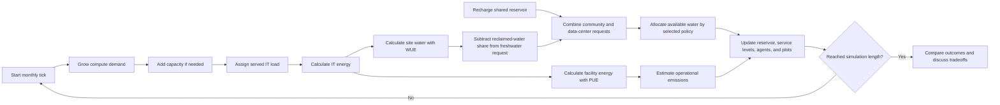

# AI Data Center Water-Energy Nexus

A neutral, interactive NetLogo scenario model for a Science, Technology, and Society course project. It explores how hypothetical AI data-center growth could interact with freshwater availability, community demand, facility efficiency, water reuse, electricity mix, and operational emissions in a Philippine setting.

This is a teaching model, not a forecast or digital twin of PAX Silica. Except for cited metric definitions, all default values and scenario settings are illustrative.

## Project flow



## What is included

- Three agent types: data centers, one aggregate community, and one shared water source.
- One tick per 30-day month.
- Adjustable demand growth, facility capacity, PUE, WUE, reclaimed water, renewable electricity, drought, recharge, community demand, rainfall variability, and random seed.
- Three neutral presets: `Reference baseline`, `Rapid growth + drought`, and `Efficiency + reuse`.
- Three allocation rules: `proportional`, `community-first`, and `data-center-first`.
- Live agents, monitors, and plots for water stock, requests, service levels, energy, and operational emissions.
- Formula self-tests, runtime invariants, and four BehaviorSpace experiments.

The MVP intentionally excludes construction impacts, manufacturing, jobs, costs, groundwater flow, biodiversity, e-waste, embodied emissions, and detailed hydrology.

## Run the model

Use NetLogo 7.0.4 or a compatible NetLogo 7 release:

1. Open `models/ai-data-center-water-energy.nlogox`.
2. Choose a scenario.
3. Click `load-scenario`.
4. Click `setup`.
5. Click `go`, or use `go-once` to advance one month.
6. Use `run-self-tests` at any time to check the resource equations and allocation rules.

For a clear classroom comparison, run `Rapid growth + drought`, then `Efficiency + reuse`. They use the same 30% annual demand growth and 40% drought assumptions, making the modeled efficiency and reuse changes easier to compare.

## Model equations

| Outcome | Calculation | Unit |
| --- | --- | --- |
| Monthly IT energy | IT load MW × 1,000 × 720 hours | kWh/month |
| Site water | IT energy × WUE ÷ 1,000,000 | ML/month |
| Freshwater request | Site water × (1 − reclaimed share) | ML/month |
| Facility energy | IT energy × PUE | kWh/month |
| Operational emissions | Facility energy × grid factor × non-renewable share ÷ 1,000 | tonnes/month |

WUE uses IT energy, not PUE-adjusted facility energy. Reclaimed water reduces modeled freshwater withdrawal but does not erase total site water use.

## BehaviorSpace checks

The model contains:

- `smoke-test`: runs the self-tests and the reference scenario for 120 months.
- `scenario-comparison`: runs all three presets for 120 months.
- `rainfall-uncertainty`: runs the rapid-growth-and-drought case using seeds 1–30 and 20% rainfall variability.
- `allocation-policy-check`: holds the physical shortage constant while comparing all three allocation policies.

Example PowerShell command:

```powershell
$netLogoConsole = 'C:\Program Files\NetLogo 7.0.4\NetLogo_Console.exe'
& $netLogoConsole --headless `
  --model "$PWD\models\ai-data-center-water-energy.nlogox" `
  --experiment 'scenario-comparison' `
  --table "$PWD\results\scenario-comparison.csv"
```

CSV files in `results/` are intentionally ignored by Git.

## Verified draft results

These are conditional outputs from the built-in illustrative settings, recorded at month 120 in NetLogo 7.0.4:

| Scenario | Data centers | Compute demand MW | DC freshwater request ML/month | Reservoir ML | Community service | DC water service | Cumulative operational emissions t |
| --- | ---: | ---: | ---: | ---: | ---: | ---: | ---: |
| Reference baseline | 3 | 141.59 | 101.95 | 1,998.05 | 100% | 100% | 3,976,834.96 |
| Rapid growth + drought | 10 | 482.50 | 416.88 | approximately 0 | 54.40% | 54.40% | 8,939,164.37 |
| Efficiency + reuse | 10 | 482.50 | 55.58 | 2,044.42 | 100% | 100% | 2,421,023.68 |

Under the rapid-growth shortage at month 120, all allocation rules supplied the same total 390 ML and left the same 326.88 ML shortfall. They distributed that water differently: proportional allocation gave both groups 54.40% service; community-first gave the community 100% and data centers 21.59%; data-center-first gave the community 0% and data centers 93.55%. This demonstrates distributional tradeoffs without treating any policy as inherently correct.

The 30-seed rainfall experiment produced 30 completed runs. Repeating it generated identical metrics for each seed, confirming seeded reproducibility in the tested runtime.

## STS and SDG connection

- **Science:** transparent equations, stated units, seeded experiments, and falsifiable comparisons.
- **Technology:** compute demand, cooling-water efficiency, facility energy efficiency, water reuse, and electricity mix.
- **Society:** competition for a shared resource, service outcomes, and value choices in allocation policy.
- **SDG 6:** clean water, access, and water-use efficiency.
- **SDG 9:** resilient infrastructure and technological development.
- **SDG 12:** resource efficiency and reclaimed-water use.
- **SDG 13:** operational electricity emissions and lower-carbon electricity scenarios.

## Evidence boundary and sources

Official material describes PAX Silica primarily as a broader semiconductor manufacturing and innovation ecosystem. This model therefore uses PAX Silica only as Philippine STS context and does not assign whole-development water figures to its hypothetical data-center agents.

- Official project context: [PCO / BCDA — PAX Silica manufacturing-and-innovation framing](https://pco.gov.ph/news_releases/bcda-says-pax-silica-project-could-generate-over-130000-high-quality-jobs/)
- Official metric definition: [U.S. DOE FEMP — Cooling Water Efficiency Opportunities for Federal Data Centers](https://www.energy.gov/cmei/femp/cooling-water-efficiency-opportunities-federal-data-centers)
- Official design guidance: [U.S. DOE FEMP — Best Practices Guide for Energy-Efficient Data Center Design](https://www.energy.gov/sites/default/files/2024-07/best-practice-guide-data-center-design.pdf)
- Software documentation: [NetLogo BehaviorSpace manual](https://docs.netlogo.org/behaviorspace.html)
- Originality check source: [Official NetLogo Models Library repository](https://github.com/NetLogo/models)
- Course-draft background: [IBM — What Is an AI Data Center?](https://www.ibm.com/think/topics/ai-data-center)
- Course-draft background: [Penn State — Why AI Uses So Much Energy](https://iee.psu.edu/news/blog/why-ai-uses-so-much-energy-and-what-we-can-do-about-it)
- Course-draft background: [Brookings — The Future of Data Centers](https://www.brookings.edu/articles/the-future-of-data-centers/)
- Group working document: [Project Ideas Google Doc](https://docs.google.com/document/d/1kEvWeX4g3D4XUFAYUSCoRyC-APubSqgBAyP7mwPBvUk/edit)

The official Models Library was searched for obvious matching titles related to AI data centers, water usage, cooling, and water stress. No obvious title match was found; this supports originality but does not prove that no conceptually related model exists.

## Before submission

- Add the group members’ names in the NetLogo Info tab.
- Confirm the instructor’s NetLogo version. If the class requires NetLogo 6.4 or earlier, export a legacy `.nlogo` copy and rerun every check.
- Agree as a group on which assumptions to explain during the presentation.
- Present outputs as “under these assumptions,” not as predictions of the real PAX Silica project.
